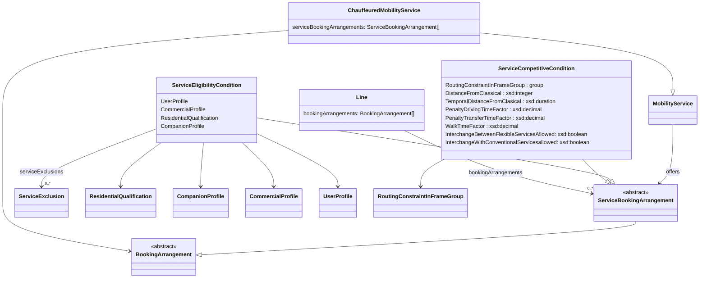

# DRT examples and explanations
We expanded for NeTEx 2.1 DRT in serious manner.

## Updates in NeTEX 2.1
- `FlexibleLine` is folden into `Line`. Be aware that an area-oriented services is also a "line".
- There can now exist multiple `ServiceBookingArrangement` and related stuff in a `mobilityService`.
- There can now be also (multiple) `ServiceBookingArrangement` in a `Line`.
- `BookingNote` is now also an object that can be referenced and translated with `AlternativeText`. **TODO**
- `serviceBookingArrangements` can now accept all other elements to describe the services:
  - `ServiceBookingArrangement`: How to book
  - `ServiceCompetitiveCondition`: What to do and what not
  - `ServiceEligibilityCondition`: Who can use the service.
- The interaction of such serviceBookingArrangements is additive. Eg. all elements are within their group connected by OR. E.g. you are a senior or a child you can use the service. Be aware that this MAY result in the need to split a service to do it.

## Types of demand responsive traffic (DRT)

Based on the [concept in Switzerland](https://www.oev-info.ch/sites/default/files/2024-07/Fachkonzept%20On-Demand_v2.1_en.pdf).

### Scheduled on-demand
The on-demand service serves the same stops as the normal service, but only 
on demand (travellers must book their journey in advance). Accordingly, this
can also be shown in the classic timetable.
For example: Only the first and last stops on a regular timetable are served, as 
a journey is only booked in advance at these stops.

(Demand)stops

They are registered in DiDok and are subject to all relevant 
regulations, laws, V580 rules etc. for public transport stops.
Fixed direction of travel: the vehicle generally moves in a fixed direction of 
travel. This means that an indicative timetable and connection protection can 
be defined.

Fixed sequence of stops/points

The order in which the stops or static stops 
are served is predefined. 

Fixed timetable

With a fixed direction of travel with a fixed sequence of 
stops/points, a fixed timetable can be defined. The times must be strictly adhered to (see also the comparison with the timetable below). 
Connections defined: The service plan defines which connections should be 
maintained on arrival and departure at a station or other junction. A (indicative) 
timetable is required to define a connection guarantee. 

Service plan

The service plan contains the timetable for the line-based on-demand transport services. 
Necessary information includes the journey number, days of service, route, arrival, 
departure and transit times at the operating points and the permitted speeds in the 
individual sections of the route. 
There are also various other attributes such as low-floor buses, bar trolleys, bicycle 
transport and the obligation to make reservations.

### Corridor
n-Demand Korridorverkehr (corridor transport) has Sammelstellen ("collection points") in addition to the on-demand stops of On-Demand Linienverkehr
(scheduled on-demand). This creates a corridor (i.e., visually, if you imagine 
horizontal boundaries above and below the "main route" in the figure above). 
The bus will still only travel to locations for which a journey has been booked 
in advance.
The on-demand stops and collection points can be described in a timetable 
as a logical sequence. Either a fixed timetable or an indicative timetable can 
be created. For example, the indicative timetable (for the figure above) could 

Type Definition

provide for the departure from the two Sammelstellen ("collection points") and 
three on-demand stops, which would serve all 5 locations. If there were only 
reservations for the on-demand stops, then only the on-demand stops would 
be served (i.e., as a line).
Note: If the sequence cannot be adhered to, a timetable is excluded and only 
an indicative timetable is possible.

Sammelstelle (collection points)

are defined by the on-demand provider 
and have a fixed designation and a fixed geo-localisation. However, they are 
not available in the DiDok or cannot be handled by it (according to the current 
status).

Richtfahrplan (indicative timetable)

With a fixed direction of travel, possible 
service times are defined for individual stops/points. An indicative timetable 
can be defined, even if the sequence of stops/points is not fixed. It does not 
necessarily have to be possible to adhere to an indicative timetable (with a 
single vehicle)

### Area-oriented
With on-demand Flächenverkehr (areal transport), any stopping points within 
a zone are served during predefined (zone) operating times. The booked journeys can be bundled by the operator (depending on the business model).
This service does not have a pre-planned timetable. Instead, the demand request generates an "ad hoc" journey with different routes and without a fixed 
route. This means that journey times can vary from journey to journey. 
For example, a person could request transport from any location (their own 
front door) to a bus stop and use a taxi to get there. If several journeys are 
booked to/from the same location, a kind of shared taxi/bus could be formed.
Any location: represent geo-coordinates at which a destination, intermediate 
or end point of a journey is located. Although these must be stored in the form 
of a log (e.g. for billing purposes), they do not have to be persisted in a data 
storage system. In particular, the geo-coordinates themselves are already 
uniquely defined and do not require any special technical processing.

These services do not have a pre-planned timetable with journeys, but operating times 
and a predefined service area. If stops or Sammelstellen ("collection points") are used, 
these must also be defined. In addition, rules (see below) must be specified. An "ad 
hoc" journey with individual journeys and without a fixed route is generated via the 
demand. The journey times can vary from journey to journey, with the aim of ensuring 
that the operators organise the most ideal pooling and journey schedules possible. 
Measuring quality in terms of punctuality in the conventional sense is only possible to 
a limited extent. It still needs to be checked what waiting times are acceptable for 
customers.
The description of the area-type ODV offer is provided as an offer plan with the following information:
- Service areas and possible subdivision into zones
- Public transport stops, collection points or addresses
- operating times
- Rules
  - Zone rules (e.g. restrictions for journeys between zones)
  - Stop rules (e.g. a stop may not be approached by regular traffic)
  - Competition rules (the journey must not run parallel to a regular bus)
  - Waiting rules 
  - Connection rules (e.g. for feeders)
  - Ordering and reservation rules 
  - Further rules

### Special case: Feeder/Distributor
- Feeder/Distributor: Some stops are defined and used for interchanges (e.g. school buses, late-night bringing passengers home from railway station)


### Special case: Hail and ride
**TODO**

### Special case: Mixed line
(e.g. within the village everywhere between village given stops)

### Special case: Pooling
In Transmodel POOLING is something different. For the time being we will NOT model it here.

## Diagram of relevant elements



## The new LineType
As mentioned FlexibleLine is gone. It is all in Line now. So the FlexibleLineType and the LineType are now in one.

We omit the classical part of LineType and focus on the relevant values.

| LineType                  | Explanation                                                                                                       |
|---------------------------|-------------------------------------------------------------------------------------------------------------------|
| flexible                  | Use this for fixed timetable, but when reservation for stops or the journey is needed                             |
| corridorService           | This is used for corridor services.                                                                               |
| mainRouteWithFlexibleEnds | Do not use this.                                                                                                  |
| flexibleAreasOnly         | Multiple areas are used. No fixed stops                                                                           |
| hailAndRideSections       | When there are hail and ride parts in your fixed scheduled ride.                                                  |
| fixedStopAreaWide         | Area but with fixed stops only                                                                                    |
| freeAreaAreaWide          | One free area where it stops everywhere.                                                                          |
| mixedFlexible             | Different concepts are used on the same line, but no part is fixed (e.g. in one area fixed stops, then corrridor. |
| mixedFlexibleAndFixed     | Used for some types of corridors. E.g. free within villages and fixed route between them                          |
| other                     | Do not use this.                                                                                                  |

## TypeOfFlexibleService
**TODO** Will we do something here?

```
                TypeOfFlexibleService id="ch:1:TypeOfFlexibleService:L" version="any">
                  <Name lang="de">Bedarfslinie</Name>
                  <ShortName lang="de">L</ShortName>
                  <PrivateCode>1</PrivateCode>
                </TypeOfFlexibleService>
                <TypeOfFlexibleService id="ch:1:TypeOfFlexibleService:A" version="any">
                  <Name lang="de">Anrufsammelverkehr</Name>
                  <ShortName lang="de">A</ShortName>
                  <PrivateCode>2</PrivateCode>
                </TypeOfFlexibleService>
                <TypeOfFlexibleService id="ch:1:TypeOfFlexibleService:Ö" version="any">
                  <Name lang="de">Richtungsband, örtlich disponierter Bus</Name>
                  <ShortName lang="de">Ö</ShortName>
                  <PrivateCode>3</PrivateCode>
                </TypeOfFlexibleService>
                <TypeOfFlexibleService id="ch:1:TypeOfFlexibleService:Z" version="any">
                  <Name lang="de">Zeitbezogener Flächenverkehr</Name>
                  <ShortName lang="de">Z</ShortName>
                  <PrivateCode>4</PrivateCode>
                </TypeOfFlexibleService>
                <TypeOfFlexibleService id="ch:1:TypeOfFlexibleService:F" version="any">
                  <Name lang="de">Freier Flächenverkehr</Name>
                  <ShortName lang="de">F</ShortName>
                  <PrivateCode>5</PrivateCode>
                </TypeOfFlexibleService>
```
## CollectionPoints

```
            <ValueSet id="ch:1:ValueSet:TypeOfPlace" version="any" nameOfClass="TypeOfPlace">
              <values>
                <TypeOfPlace id="ch:1:TypeOfPlace:regularStop" version="any">
                  <Name>regular stop</Name>
                </TypeOfPlace>
                <TypeOfPlace id="ch:1:TypeOfPlace:drtCollectionPoint" version="any">
                  <Name>DRT collection point</Name>
                </TypeOfPlace>
              </values>
            </ValueSet>
```
## "The rules"
What is really new is the extension of the rules part.
One main advantage now is that many rules can be included.

**NOTE**: Many of the rules are not amusing the consumers.


### The BookingArrangement: How to make a reservation / book
The relevant element is `ServiceBookingArrangement`.

This also will provide more information for connections to booking services **TODO**

### Competition Rules
In some cases DRT is not allowed to compete in some ways with scheduled public transport.
We have a set of parameters that can be set in a `ServiceCompetitiveCondition`:
- Routing constraint: Restrictions in what the SERVICE is allowed to do in connection with other SERVICES. If not set, then the rules apply in general.
- Distance from classical: Distance in metres to the line/service or classical public transport in general. Builds geometric exclusion zones.
- Temporal distance from classical: Temporal distance to the SERVICE / transfer in the RoutingConstraint or classical public transport in general.
- Penalty transfer time factor: Factor to multiply the classical public transfer times with for the calculation of the dominance of the demand responsive traffic.
- Walk time factor: Factor to multiply walk time for the classical public transport to calculate if the classical public transport still should dominate the demand responsive traffic.
- Are interchanges with flexible and/or conventional services allowed.

### Eligibility Rules
We will use `ServiceEligibilityCondition` to describe the eligibility.
The eligibility can be based on:
- `UserProfile`: Social profile of the passenger, based on age group, education, profession, social status, gender etc.
- `CommercialProfile`: A category of users depending on their commercial relations with the operator (e.g. frequency of usage)
- `ResidentialQualitfication`: e.g. live, work, study, exchange, nonResident
- `CompanionProfile`: The number of characteristics (weight/volume of luggage), but here the CompanionRelationshipType is the important thing: e.g. child, family, dependent, carer)


## Examples 

### Regular line that runs and stops only when there are reservations.
- LineType="flexible"
- [XML](./CH_DRT_Line_Based_Reservation.xml)
### Area oriented with fixed CollectionPoints
In the Gotthard area mybuxi is providing services from CollectionPoints that can change a lot. CollectionPoints near railway stations are stable.

- LineType="fixedStopAreaWide"
- [XML](./CH_DRT_Area_mybuxi.xml)
- [Example ENTUR](KOL_KOL-FlexibleLine-a318c9ea-bae0-49da-8356-f4820e1d9cdd_9955_HentMeg---Sauda.xml)

### A mixed line with regular parts on area-oriented parts
- LineType="mixedFlexible"
- [XML](SKY_SKY-FlexibleLine-9ef2772d-b2b5-4b3a-935e-32d49ff6576e_Samnanger-ytre.xml)
