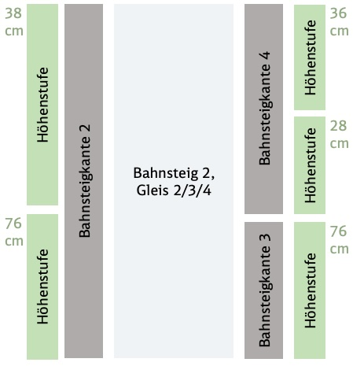

= Befüllungsregeln für das NeTEx Mapping

== StopPlace - STATION GENERAL CHARACTERISTICS

.Table NeTEx Mapping - STATION GENERAL CHARACTERISTICS
[%header,cols="1a,1a,2a,1a,1a,2a"]
|===
2+|Inventory of Assests (IoA)
3+|NeTEx
|

|*STATION GENERAL CHARACTERISTICS*
|*Format*
|*Klasse*
|*Element*
|*Mapping*
|*Beschreibung*

.2+|*Name of station*
.2+|String
.2+|GroupOfEntitiesGroup
|Name
|/StopPlace/Name
|
|ShortName
|/StopPlace/ShortName
|

.5+|*Station code*
.5+|String
|StopPlace
|@Id
|/StopPlace/@Id
|DHID des StopPlaces

|KeyList
|Value
|/StopPlace/keyList/KeyValue[Key="UUID"]/Value"
|eindeutige ID (key=*UUID*) der Station

|KeyList
|Value
|/StopPlace/keyList/KeyValue[Key="stationId"]/Value"
|Eindeutige ID (key=*stationId*) der Station in den Systemen von DB S&S

|KeyList
|Value
|/StopPlace/keyList/KeyValue[Key="EVA"]/Value"
|
Elektronische Verkehrsauskunft (EVA)-Nummer (key=*EVA*) ist der eindeutige Schlüssel einer Haltestelle in dem Europäischem Fahrplanzentrum (EFZ)

Aktuell kann es für eine Station aus mehreren Haltestellen im EFZ zusammensetzewn.

|KeyList
|Value
|/StopPlace/keyList/KeyValue[Key="EVA"]/Value"
|Die UIC (key=*UIC*) stellt die tarifliche Sicht auf eine Haltestelle im Ausland dar.

Aktuell kann sich eine Station aus mehreren UIC Haltestellen zusammensetzen.

|Station Address
|String
|AddressablePlaceGroup
|PostalAddress
|/StopPlace/PostalAddress
|

|City name
|String
|PostalAddress
|Town
|/StopPlace/PostalAddress/Town
|

|
|
|AddressablePlaceGroup
|Url
|/StopPlace/Url
|

|
|
|SiteElementNamesGroup
|alternativeNames
|/StopPlace/alternativeNames/AlternativeName[TypeOfName="speechLong"]
|
Übersicht alternative Namen:
[%header,cols="1a,1a,1a"]
!===
!Feld
!NameType
!TypeOfName

!text to speech (long)
!alias
!speechLong

!text to speech (short)
!alias
!speechShort
!===

|
|
|SiteGroup
|levels
|/StopPlace/levels
|Für eine Station werden alle Stockwerke (levels) definiert, da in anderen Bauwerksteilen und Equipments darauf verwiesen wird.
|GPS coordinates
|String
|LocationStructure
|Location
|/StopPlace/Centroid/Location
|GPS Cordinate wird mit Longitude und Latitude dargestellt

|
|
|StopPlacePropertyGroup
|StopPlaceType
|/StopPlace/StopPlaceType
|Es handelt sich hier immer um Stationen aka Bahnhöfe *railStation*

|
|
|StopPlacePropertyGroup
|BorderCrossing
|/StopPlace/BorderCrossing
|Handelt es sich um eine Grenzhaltestelle

|Accessible station
|Yes/Assistance required/No
|
|
|
|folgt in einer späteren User-Story

|PRM TSI compliant station
|Yes/Partly/No
|
|
|
|folgt in einer späteren User-Story

|
|
|SiteGroup
|entrances
|/StopPlace/entrances
|
Ein Eingang definiert den Ort an dem Reisende einen Bahnhof betreten und verlassen können.
Er ist Teil der äußeren Grenze des Bahnhofs, bis zu der das Hausrecht des Betreibers gilt.

Die dazugehörigen PlaceEquipments und Equipments in werden noch hinzugefügt.

Anmerkung:

- Ein -und Ausgänge werden über Entrance wie in dem EPIAP examples und nicht als StopPlaceEntrances modeliert.

|Station Reference point
|Defined as an ‘access space/entrance’
in NeTEx
|SiteGroup
|accessSpaces
|/StopPlace/accessSpaces
|
Orte am/im Bahnhof ohne direkten Zugang zu einem Fahrzeug (Wartebereich, Übergänge, Bahnhofshal-len, Tunnel, Brücken, etc.).

Bahnhofseingänge (siehe *entrances*) werden zu den Gebäudeteile über das Feld *ParentZoneRef* verbunden.

|===

== Bahnsteig Layout
NeTEx liefert bei der Abbildung auf Bahnsteigen, Bahnsteigkanten, Abschnitte, Kundenteilgleise, gleisbezogene Bahnsteignutzlänge und Höhenstufen auf die NeTEx Elemente *Quay* Freiheiten.
Dieses Kapitel beschreibt die Fachlichkeit und die daraus folgende NeTEx Abbildung.

=== Bahnsteig
Der Bahnsteig hat ein oder mehrere Bahnsteigkanten und mindestens einen Zugang nach außen bzw. zu einem anderen Bahnhofsteil.
Ein Bahnsteig wird in NeTEx über das NeTEx Element *Quay* mit dem *QuayType* *railIslandPlaform* abgebildet.

Für ein Bahnsteig werden die folgenden Werte ausgegeben:

* der Name des Bahnsteiges laut Beschilderung im Bahnhof
* die GeoPosition
* die Länge (NeTEx Element *Length*) und die Breite (NeTEx Element *Width*) des öffentlich zugänglichen Bereich ausgegeben.

Die Bahnsteigkanten aka Gleise werden über die Eltern-Kind-Beziehung des NeTEx *Quays* modelliert.

Die Id eines Bahnsteiges ist die DHID::Bereich. Im ZHV ist für einen Bahnsteig die DHID::Bereich hinterlegt.

=== Bahnsteigkante
Eine Bahnsteigkante (in der Kundenkommunikation im Fahrplan ist der Begriff Gleis gebräuchlich) ist jeder Abschnitt an der physischen Kante eines Bahnsteigs, der in der Beschilderung für den Kunden ausgeschildert ist.
Eine Bahnsteigkante wird in NeTEx über das NeTEx Element *Quay* mit dem *QuayType* *railPlaform* abgebildet.

Für eine Bahnsteigkante werden die folgenden Werte ausgegeben.

* Name der Bahnsteigkante laut der Beschilderung
* die Bahnsteighöhe (NeTEx Element *PlatformHeight*). Mit Wissen des Aufbau des Fahrzeuges kann ermittelt werden, ob ein niveau gleicher Einstieg möglich ist. Die Bahnsteighöhe wird nur ausgegeben, wenn eine Bahnsteigkante eine durchgängie Höhe hat. Hat eine Bahsteigkante mehrere Höhenstufen, so wird die Höhe in der Höhenstufe angegeben.
* die Länge (NeTEx Element *Length*)
* der Abstand zwischen der Bahnsteigkante und dem Mittelpunkt des Gleiskörpers (NeTEx Element *EdgeToTrackCenterDistance*) ausgegeben. Mit Hilfe des Wertes und dem Wissen der Breite des Fahrzeuges kann des Spalt zwischen Bahnsteigkante und Fahrzeug ermittelt. Dieser Wert wird nur ausgegeben, wenn die baulichen Voraussetzung vorhanden sind.
* der Transport-Typ (NeTEx *TransportMode*) bei Bahnhöfen wird in der Regel mit dem Wert *rail* befüllt

Der zu der Bahnsteigkante gehörende Bahnsteig wird über die Eltern-Kind-Beziehung des NeTEx *Quays* abgebildet.

=== Abschnitte aka Sektoren
Der Begriff *Sektor* wird in VDV 454 verwendet, um die Abschnitte des Gleises zu benennen, an denen (Abschnitts-)Würfel mit den Aufschriften 'A' - 'G' (vereinzelt auch weiter im Alphabet) hängen.
Die Sektoren dienen u.a. dazu, einem Reisenden die Position des Fahrzeugs, in dem seine Reservierung zu finden ist, mitzuteilen.

Ein Abschnitt aka Sektor wird über das NeTEx Element *Quay* mit dem *QuayType* *railPlatformSector* und der Ausprägung des Typens über *TypeOfPlaceRef* und der id *quay:section* repräsentiert. Für einen
Abschnitt werden, wie für die
Bahnsteigkante, der Name,
die Länge,
Höhe und der Abstand von der Gleiskante
zu dem Mittelpunkt des Gleiskörpers ausgegeben.

Der zum Abschnitt gehörende Bahnsteigkante wird über die Eltern-Kind-Beziehung des NeTEx *Quays* abgebildet.

=== Kundenteilgleise
Kundenteilgleise sind eine Spezialform von Bahsteigkanten. In manchen Fällen (z.B. in Mainz Hbf - de:07315:9037, Gleis 4a und 4b) werden zu einer Bahnsteigkante mehrere Kundenteilgleise genutzt. Kundenteilgleise werden sowohl in der Bahnhofsauschilderung als auch im Fahrplan als Gleisangabe verwendet.
Kundenteilgleise werden über das NeTEx Element *Quay* mit dem *QuayType* *railPlaform* abgebildet.
Da ein Kundenteilgleis eine Spezialform von einer Bahnsteigkante ist, werden im Kundenteilgleis die gleichen Informationen ausgegeben, wie bei einer Bahsteigkante.

Die Abschnitte der Kundenteilgleise werden referenizeren als Kind-Element auf das Kundenteilgleis.

Die zu dem Kundenteilgleis gehörende Gleiskante wird über die Eltern-Kind-Beziehung des NeTEx *Quays* abgebildet.

=== Höhenstufen
Unter Umständen hat eine Bahnsteigkante aus baulichen Gründen mehrere Höhenstufen. Eine Höhenstufe ist jeder Abschnitt einer Bahnsteigkante mit einer einheitlichen Bahnsteighöhe. Eine Höhenstufe kann zu einer oder mehreren Bahnsteigkanten zugeordnet sein.
Die Höhenstufe kann zur Beurteilung, ob ein MER einen Zug ohne fremde Hilfe besteigen kann, verwendet werden.

Eine Höhenstufe wird über das NeTEx Element *Quay* mit dem *QuayType* *railPlatformSector* mit der Ausprägung des Typens über *TypeOfPlaceRef* und der id *quay:platformHeight* repräsentiert.
Für eine Höhenstufe werden, wie für die Bahnsteigkante, die Länge, Höhe und der Abstand von der Gleiskante zu dem Mittelpunkt des Gleiskörpers ausgegeben.

=== gleisbezogene Bahnsteignutzlänge
Die Angabe einer gleisbezogenen Bahnsteignutzlänge ist speziell für EVUs notwendig, um beispielsweise zu ermitteln ob ein Zug weitere Waggons anhängen kann. Die gleisbezogenen Bahnsteignutzlänge
ist immer kleiner als die Bahnsteiglänge.

eine gleisbezogene Bahnsteignutzlänge wird über das NeTEx Element *Quay* mit dem *QuayType* *railPlatformSector* mit der Ausprägung des Typens über *TypeOfPlaceRef* und der id *quay:section*
repräsentiert.

Die gleisbezogene Bahnsteignutzlänge wird über die Eltern-Kind-Beziehung des NeTEx *Quays* der Bahnsteigkante oder Kundenteilgleis abgebildet.

=== Beispiel Osterburken Bahsteig 2

Die Schematische Darstellung des Bahnsteiges 2 in Osterburken verdeutlich die Abbildung der Höhenstufen

.A Bahnsteig 2 in Osterburken

An dem Bahnsteig 2 in Osterburken liegen die Bahsteigkanten 2, 3 und 4 mit verschiedenen Höhenstufen (siehe link:Osterburken-Gleis-2-3-4.JPG[Osterburken Bahnsteig 2])

=== Abbildung Bahnsteig Layout auf NeTEx

.Table NeTEx Mapping - Bahnsteig Layout
[%header,cols="1a,1a,2a,1a,1a,2a"]
|===
2+|Bahnsteig Layout
3+|NeTEx
|

|*Klasse*
|*Element*
|*Klasse*
|*Element*
|*Mapping*
|*Beschreibung*

|*Bahnsteig*
|
|Quay
|quay
|/StopPlace/quays/Quay[QuayType="railIslandPlaform"]
|Ein Bahnsteig wird über den QuayType *railIslandPlaform* identifiziert.

|*Bahnsteig*
|Id
|Quay
|@Id
|/StopPlace/quays/Quay[QuayType="railIslandPlaform"]/@Id
|Id eines Bahnsteiges ist die DHID::Bereich aus dem ZHV.

|*Bahnsteig*
|Name
|Quay
|Name
|/StopPlace/quays/Quay[QuayType="railIslandPlaform"]/Name
|Ausgeschilderte Name des Bahnsteigs.

|*Bahnsteig*
|GPS coordinates
|Location
|
|/StopPlace/quays/Quay[QuayType="railIslandPlaform"]/Centroid/Location
|GPS Cordinate wird mit Longitude und Latitude dargestellt

|*Bahnsteig*
|Länge
|Quay
|Length
|/StopPlace/quays/Quay[QuayType="railIslandPlaform"]/Length
|Gesamtlänge des Bahnteiges in Meter

|*Bahnsteig*
|Breite
|Quay
|Width
|/StopPlace/quays/Quay[QuayType="railIslandPlaform"]/Width
|Mittlere Breite des Bahnsteiges in Meter

|*Bahnsteigkante*
|
|Quay
|quay
|/StopPlace/quays/Quay[QuayType="railPlaform"]
|Eine Bahnsteigkante bzw. ein Kundenteilgleis wird über den QuayType *railPlaform* identifiziert.

|*Bahnsteigkante*
|Id
|Quay
|@Id
|/StopPlace/quays/Quay[QuayType="railPlaform"]/@Id
|Id eines Bahnsteiges ist die DHID::Mast aus dem ZHV.

|*Bahnsteigkante*
|Name
|Quay
|Name
|/StopPlace/quays/Quay[QuayType="railPlaform"]/Name
|Ausgeschilderte Name der Bahnsteigkante bzw. des Kundenteilgleis.

|*Bahnsteigkante*
|GPS coordinates
|Location
|
|/StopPlace/quays/Quay[QuayType="railPlaform"]/Centroid/Location
|GPS Cordinate wird mit Longitude und Latitude dargestellt

|*Bahnsteigkante*
|Länge
|Quay
|Length
|/StopPlace/quays/Quay[QuayType="railPlaform"]/Length
|Gesamtlänge der Bahnteigekanta aka Kundenteilgleis in Meter

|*Bahnsteigkante*
|Höhe
|Quay
|PlatformHeight
|/StopPlace/quays/Quay[QuayType="railPlaform"]/PlatformHeight
|Höhe der Bahnsteigkante. Der Wert wird nur ausgegeben, wenn die Bahnsteigkante eine durchgängige Höhe hat. Ansonsten werden die Höhen in der Höhenstufe angegeben.

|*Bahnsteigkante*
|Abstand vom der Bahnsteigkante zum Mittelpunkt des Gleiskörper
|Quay
|EdgeToTrackCenterDistance
|/StopPlace/quays/Quay[QuayType="railPlaform"]/EdgeToTrackCenterDistance
|Abstand vom der Bahnsteigkante zum Mittelpunkt des Gleiskörper.

|*Bahnsteigkante*
|Zuordnung Bahsteig
|Quay
|ParentQuayRef
|/StopPlace/quays/Quay[QuayType="railPlaform"]/ParentQuayRef
|Verweis auf die ID des Bahnsteiges (/StopPlace/quays/Quay[Id="${"ParentQuayRef"}])

|*Abschnitt*
|
|Quay
|Quay
|/StopPlace/quays/Quay[QuayType="railPlatformSector"]/placeTypes/TypeOfPlaceRef[ref="quay:section"]
|Abschnitt aka Sektor, gewöhnlich durch den (Abschnitts-)Würfel mit den Aufschriften 'A' - 'G' gekennzeichnet.

|*Abschnitt*
|Id
|BoardingPosition
|@Id
|/StopPlace/quays/Quay[QuayType="railPlatformSector"]/placeTypes/TypeOfPlaceRef[ref="quay:section"]/@Id
|Id eines Abschnitt aka. Sektors ist die DHID::Halteposition aus dem ZHV

|*Abschnitt*
|Name
|Quay
|Name
|/StopPlace/quays/Quay[QuayType="railPlatformSector"]/placeTypes/TypeOfPlaceRef[ref="quay:section"]/Name
|Ausgeschilderte Name des Abschnitt aka Sektor.

|*Abschnitt*
|
|GPS coordinates
|Location
|/StopPlace/quays/Quay[QuayType="railPlatformSector"]/placeTypes/TypeOfPlaceRef[ref="quay:section"]/Centroid/Location
|GPS Cordinate wird mit Longitude und Latitude dargestellt

|*Abschnitt*
|Länge
|BoardinPosition
|Length
|/StopPlace/quays/Quay[QuayType="railPlatformSector"]/placeTypes/TypeOfPlaceRef[ref="quay:section"]/Length
|Gesamtlänge der Höhenstufe in Meter

|*Abschnitt*
|Höhe
|BoardingPosition
|PlatformHeight
|/StopPlace/quays/Quay[QuayType="railPlatformSector"]/placeTypes/TypeOfPlaceRef[ref="quay:section"]/PlatformHeight
|Höhe der Höhenstufe.

|*Abschnitt*
|Abstand vom der Bahnsteigkante zum Mittelpunkt des Gleiskörper
|Quay
|EdgeToTrackCenterDistance
|/StopPlace/quays/Quay[QuayType="railPlatformSector"]/placeTypes/TypeOfPlaceRef[ref="quay:section"]/EdgeToTrackCenterDistance
|Abstand vom der Bahnsteigkante zum Mittelpunkt des Gleiskörper.

|*Höhenstufe*
|
|Quay
|quay
|/StopPlace/quays/Quay[QuayType="railPlatformSector"]/placeTypes/TypeOfPlaceRef[ref="quay:platformHeight"]/
|Eine Höhenstufe wird über den QuayType *railPlaformSector* identifiziert.

|*Höhenstufe*
|Id
|Quay
|@Id
|/StopPlace/quays/Quay[QuayType="railPlatformSector"]/placeTypes/TypeOfPlaceRef[ref="quay:platformHeight"]/@Id
|Id einer Höhenstufe ist die DHID::Mast aus dem ZHV. Die Id der Höhenstufe ist eine UUID, da im ZHV Höhenstufen nicht abgebildet sind.

|*Höhenstufe*
|GPS coordinates
|Location
|
|/StopPlace/quays/Quay[QuayType="railPlatformSector"]/placeTypes/TypeOfPlaceRef[ref="quay:platformHeight"]/Centroid/Location
|GPS Cordinate wird mit Longitude und Latitude dargestellt

|*Höhenstufe*
|Länge
|Quay
|Length
|/StopPlace/quays/Quay[QuayType="railPlatformSector"]/placeTypes/TypeOfPlaceRef[ref="quay:platformHeight"]/Length
|Gesamtlänge der Höhenstufe in Meter

|*Höhenstufe*
|Höhe
|Quay
|PlatformHeight
|/StopPlace/quays/Quay[QuayType="railPlatformSector"]/placeTypes/TypeOfPlaceRef[ref="quay:platformHeight"]/PlatformHeight
|Höhe der Höhenstufe.

|*Höhenstufe*
|Abstand vom der Bahnsteigkante zum Mittelpunkt des Gleiskörper
|Quay
|EdgeToTrackCenterDistance
|/StopPlace/quays/Quay[QuayType="railPlatformSector"]/placeTypes/TypeOfPlaceRef[ref="quay:platformHeight"]/EdgeToTrackCenterDistance
|Abstand vom der Bahnsteigkante zum Mittelpunkt des Gleiskörper.

|*Höhenstufe*
|Zuordnung Bahsteig
|Quay
|ParentQuayRef
|/StopPlace/quays/Quay[QuayType="railPlatformSector"]/placeTypes/TypeOfPlaceRef[ref="quay:platformHeight"]/ParentQuayRef
|Verweis auf die ID der Bahnsteigkante (/StopPlace/quays/Quay[Id="${"ParentQuayRef"}])

|*gleisbezogene Bahnsteignutzlänge*
|
|Quay
|quay
|/StopPlace/quays/Quay[QuayType="railPlatformSector"]/placeTypes/TypeOfPlaceRef[ref="quay:maxLengthTrain"]/
|Eine gleisbezogene Bahnsteignutzlänge wird über den QuayType *railPlaformSector* identifiziert.

|*gleisbezogene Bahnsteignutzlänge*
|Id
|Quay
|@Id
|/StopPlace/quays/Quay[QuayType="railPlatformSector"]/placeTypes/TypeOfPlaceRef[ref="quay:maxLengthTrain"]/@Id
|Id einer gleisbezogenen Nutzlänge ist eine generierte UUID.

|*gleisbezogene Bahnsteignutzlänge*
|GPS coordinates
|Location
|
|/StopPlace/quays/Quay[QuayType="railPlatformSector"]/placeTypes/TypeOfPlaceRef[ref="quay:maxLengthTrain"]/Centroid/Location
|GPS Cordinate wird mit Longitude und Latitude dargestellt

|*gleisbezogene Bahnsteignutzlänge*
|Länge
|Quay
|Length
|/StopPlace/quays/Quay[QuayType="railPlatformSector"]/placeTypes/TypeOfPlaceRef[ref="quay:maxLengthTrain"]/Length
|Gesamtlänge der gleisbezogene Bahnsteignutzlänge (gleisbezogene Nettolänge - Anhaltewegtoleranz) in Meter

|*gleisbezogene Bahnsteignutzlänge*
|Zuordnung Bahsteig
|Quay
|ParentQuayRef
|/StopPlace/quays/Quay[QuayType="railPlatformSector"]/placeTypes/TypeOfPlaceRef[ref="quay:maxLengthTrain"]/ParentQuayRef
|Verweis auf die ID der Bahnsteigkante (/StopPlace/quays/Quay[Id="${"ParentQuayRef"}])

|===